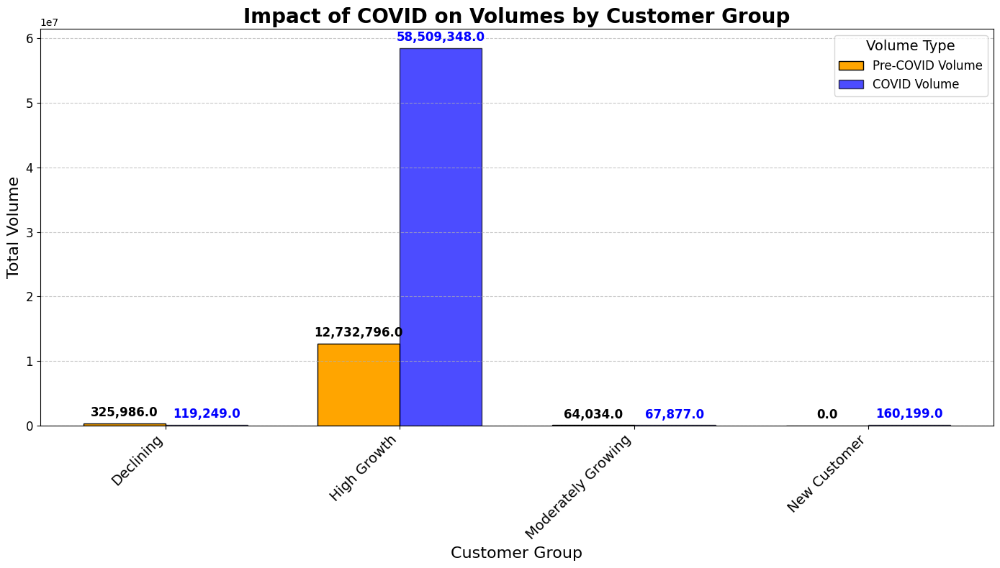

# COVID-19 Impact Analysis on Customer Volumes and Revenue

## Project Overview
This project analyzes the impact of COVID-19 on customer volumes and revenue across various customer groups. It compares pre-COVID and COVID-era data, calculates growth rates, and visualizes changes in volumes and revenue to understand the overall impact.

## Features
- **Data Aggregation**: Summarizes pre-COVID and COVID volumes, customer counts, and growth rates for each customer group.
- **Revenue Calculation**: Calculates revenue changes for pre-COVID and COVID periods.
- **Visualizations**: Generates bar charts to compare:
  - Pre-COVID vs COVID volumes by customer group.
  - Pre-COVID vs COVID revenue by customer group.
- **CSV Export**: Saves the summarized results for further analysis.

## File Structure
```
.
|-- Overall_Impact_COVID.csv   # Output file containing aggregated data
|-- COVID_Impact_Volumes.png   # Bar chart: Volumes comparison
|-- COVID_Impact_Revenue.png   # Bar chart: Revenue comparison
|-- analysis_script.py         # Python script for data analysis
|-- README.md                  # Project documentation
```

## Setup Instructions

1. **Clone the Repository**
   ```bash
   git clone https://github.com/yourusername/your-repo-name.git
   cd your-repo-name
   ```

2. **Install Dependencies**
   Ensure you have Python installed and install the required libraries:
   ```bash
   pip install pandas matplotlib
   ```

3. **Run the Script**
   Execute the analysis script:
   ```bash
   python analysis_script.py
   ```
   
4. **Results**
   - The output file `Overall_Impact_COVID.csv` will be saved in the project directory.
   - Visualizations (`COVID_Impact_Volumes.png` and `COVID_Impact_Revenue.png`) will be generated.

## Key Insights
- Analyze changes in customer volumes and revenue before and during COVID.
- Identify trends and customer groups most affected by the pandemic.

## Visualization Examples
### Impact on Volumes


### Impact on Revenue


## Requirements
- Python 3.x
- Libraries: `pandas`, `matplotlib`, 'Seaborn', 'numpy'

## Author
Ashish Pandya
Dhruvil Patel

